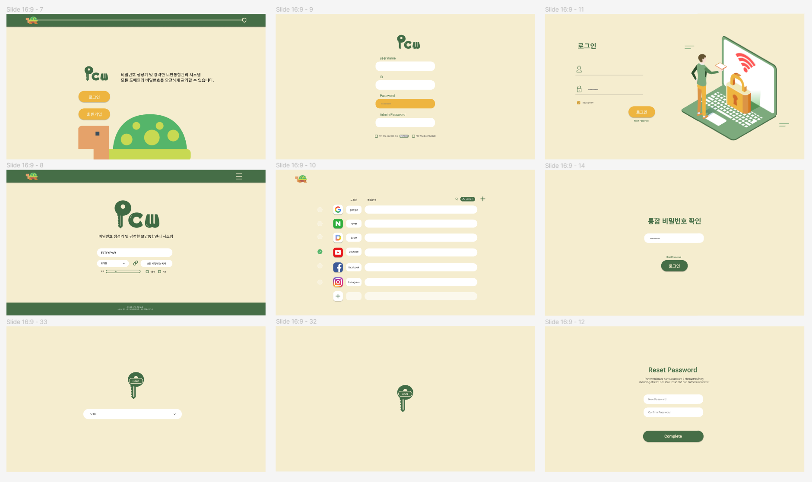

# 2022 소프트웨어 중심대학 해커톤
  * ### 팀명 : 보안 거북이
  * ### 프로젝트명 : 안전한 비밀번호 제공 및 관리 웹 개발 프로젝트

* ### 팀원 소개
  * 리더 : 인제대학교 안길웅
  * 자료 취합 : 안동대학교 임수빈
  * 영상 제공 : 전북대학교 이유정
  * 소통 : 동명대학교 김재원
  * 서버 관리 : 안동대학교 천효민

## 프로젝트 배경 및 목표
간혹 비밀번호 변경 안내를 받고 수정을 하면 이전 비밀번호와 유사한 번호,
아이디어와 4자리수 이상 중복, 등 수정을 하기 어려워지는 상황에 
짧은 변경 주기로 각 페이지마다 원하는 조건(대문자, 특수문자, 자리수)이 
있어 모든 페이지에 대해 비밀번호를 기억하고 관리하기 어렵습니다.
따라서 안전한 비밀번호 관리 웹의 필요성을 느껴 프로젝트를 시작하였습니다.
이 프로젝트로 각 도메인 별 필요한 양식에 맞춘 암호문을 만들어 
기억하기 쉽고 안전한 패스워드를 제공하는 것이 프로젝트의 목표입니다.

## 개발 환경
* Spring Boot
* Mysql & Jpa 
* View Template => ThymeLeaf
* 디자인

## 프로젝트 동작 순서
1. 사용자에게 주축이 될 패스워드 하나를 입력 받고 비밀번호가 사용될 도메인의 이름을 조합해 AES의 input값이 될 평문을 만듭니다.
2. 암호화 과정 중 키는 개발자가 따로 사용자 별 key 관리 서버를 만들어 관리합니다.
3. 사용자 별 KEY를 통해 사용자는 언제든지 평문을 암호화 및 복호화 할 수 있습니다.
4. 사용자는 만들어진 암호문을 통해 도메인별로 생성된 암호를 password로 사용하여 안전하게 비밀번호를 관리합니다.

## 암호 관련 프로젝트를 진행함에 있어 치명적인 보안적 결함 이슈 해결 고민 방안
1. 암호가 복호되던가 하는 경우 등에 이를 감지해서 유저에게 알려줄 수 있는 것들 생각.
2. 복호 될 수 있더라도 서버에서 주도적으로 복호할 수 없게끔
3. 실시간으로 유저한테 키 관리 강요 (OTP 등) One Password라는 사이트가 완전 비슷한 사이트임.
4. 유저가 메인 키를 까먹었을때의 방안

## 키 관리 방안에 대한 보안적 결함 해결 방안
1. 디피-헬먼 키 교환 알고리즘을 사용하여 사용자와 서버끼리 세션키를 만들어 키를 관리한다. (제일 현실적)
2. KISA 알고리즘 사용..?
3. 제 3자에게 키를 위임하면 되는데 제 3자도 믿을만한가..... 결국 블록체인...?

## 프로젝트 디자인

